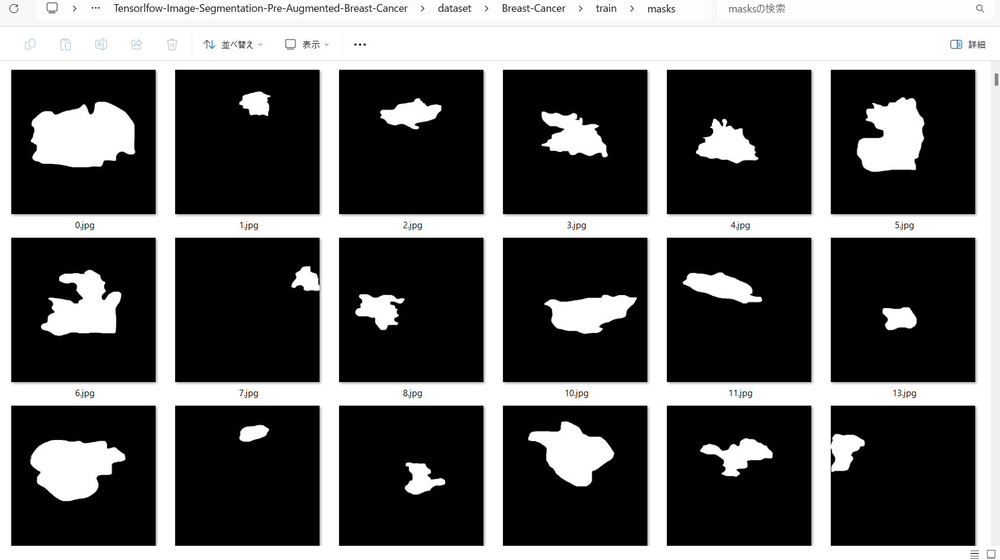
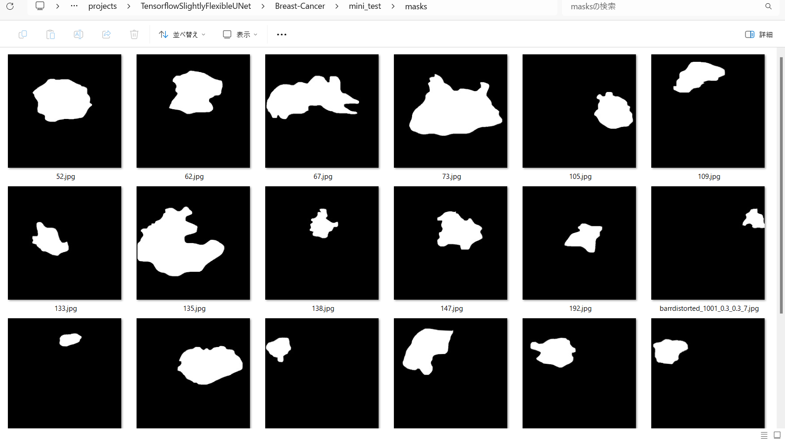
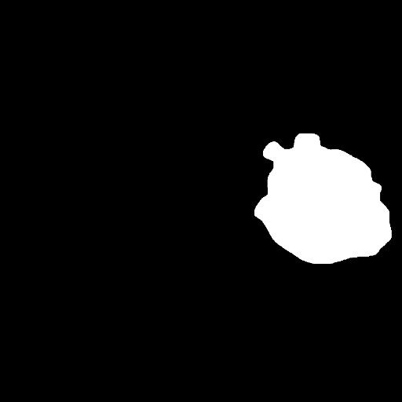

<h2>Tensorflow-Image-Segmentation-Pre-Augmented-Breast-Cancer (2025/01/05)</h2>

This is the second experiment of Image Segmentation for Breast-Cancer
 based on 
the latest <a href="https://github.com/sarah-antillia/Tensorflow-Image-Segmentation-API">Tensorflow-Image-Segmentation-API</a>, 
and a pre-augmented <a href="https://drive.google.com/file/d/1dJFAMEeyw_h2n1k9BMaCBG9N897F4fnm/view?usp=sharing">
Breast-Cancer-ImageMask-Dataset.zip</a>, which was derived by us from Malignant 
<a href="https://www.kaggle.com/datasets/aryashah2k/breast-ultrasound-images-dataset">
Breast Ultrasound Images Dataset
</a>
 
 
Please see also the first experiment <a href="https://github.com/atlan-antillia/Image-Segmentation-Breast-Cancer">
Image-Segmentation-Breast-Cancer
</a>
  
<b>Data Augmentation Strategy:</b> 
 To address the limited size of Breast-Cancer,which contains 210 images and their corresponding masks in Malignant Dataset_BUSI_with_GT, 
 we employed <a href="./generator/ImageMaskDatasetGenerator.py">an offline augmentation tool</a> to generate a pre-augmented dataset, which supports the following augmentation methods.
 
<li>Vertical flip</li>
<li>Horizontal flip</li>
<li>Rotation</li>
<li>Shrinks</li>
<li>Shears</li> 
<li>Deformation</li>
<li>Distortion</li>
<li>Barrel distortion</li>
<li>Pincushion distortion</li>
 
Please see also the following tools  
<li><a href="https://github.com/sarah-antillia/Image-Deformation-Tool">Image-Deformation-Tool</a></li>
<li><a href="https://github.com/sarah-antillia/Image-Distortion-Tool">Image-Distortion-Tool</a></li>
<li><a href="https://github.com/sarah-antillia/Barrel-Image-Distortion-Tool">Barrel-Image-Distortion-Tool</a></li>
 

<b>Actual Image Segmentation for Images of 512x512 pixels</b> 
As shown below, the inferred masks look similar to the ground truth masks.  
<table>
<tr>
<th>Input: image</th>
<th>Mask (ground_truth)</th>
<th>Prediction: inferred_mask</th>
</tr>
<tr>
<td></td>
<td></td>
<td></td>
</tr>

<tr>
<td></td>
<td></td>
<td></td>
</tr>

<tr>
<td></td>
<td></td>
<td></td>
</tr>
</table>

 
In this experiment, we used the simple UNet Model 
<a href="./src/TensorflowUNet.py">TensorflowSlightlyFlexibleUNet</a> for this Breast-Cancer Segmentation Model. 
As shown in <a href="https://github.com/sarah-antillia/Tensorflow-Image-Segmentation-API">Tensorflow-Image-Segmentation-API</a>.
you may try other Tensorflow UNet Models: 

<li><a href="./src/TensorflowSwinUNet.py">TensorflowSwinUNet.py</a></li>
<li><a href="./src/TensorflowMultiResUNet.py">TensorflowMultiResUNet.py</a></li>
<li><a href="./src/TensorflowAttentionUNet.py">TensorflowAttentionUNet.py</a></li>
<li><a href="./src/TensorflowEfficientUNet.py">TensorflowEfficientUNet.py</a></li>
<li><a href="./src/TensorflowUNet3Plus.py">TensorflowUNet3Plus.py</a></li>
<li><a href="./src/TensorflowDeepLabV3Plus.py">TensorflowDeepLabV3Plus.py</a></li>

 

<h3>1. Dataset Citation</h3>
The dataset used here has been take from the following kaggle web site:  

<a href="https://www.kaggle.com/datasets/aryashah2k/breast-ultrasound-images-dataset">
<b>Breast Ultrasound Images Dataset </b>
</a>
  
<b>About Dataset</b> 
Breast cancer is one of the most common causes of death among women worldwide. 
Early detection helps in reducing the number of early deaths. 
The data reviews the medical images of breast cancer using ultrasound scan. 
Breast Ultrasound Dataset is categorized into three classes: normal, benign, and malignant images. 
Breast ultrasound images can produce great results in classification, detection, 
and segmentation of breast cancer when combined with machine learning.

  
<b>Data</b> 
The data collected at baseline include breast ultrasound images among women in ages between 25 and 75 years old. 
This data was collected in 2018. The number of patients is 600 female patients. 
The dataset consists of 780 images with an average image size of 500*500 pixels. 
The images are in PNG format. The ground truth images are presented with original images. 
The images are categorized into three classes, which are normal, benign, and malignant.
 
 
<b>Citation</b> 

Al-Dhabyani W, Gomaa M, Khaled H, Fahmy A.  
Dataset of breast ultrasound images. Data in Brief.  
2020 Feb;28:104863.  
DOI: 10.1016/j.dib.2019.104863. 
 

<b>License</b> 
CC0: Public Domain
 
<h3>
<a id="2">
2 Breast-Cancer ImageMask Dataset
</a>
</h3>
 If you would like to train this Breast-Cancer Segmentation model by yourself,
 please download the dataset from the google drive  
<a href="https://drive.google.com/file/d/1dJFAMEeyw_h2n1k9BMaCBG9N897F4fnm/view?usp=sharing">
Breast-Cancer-ImageMask-Dataset.zip</a>
, expand the downloaded ImageMaskDataset and put it under <b>./dataset</b> folder to be
<pre>
./dataset
└─Breast-Cancer
    ├─test
    │   ├─images
    │   └─masks
    ├─train
    │   ├─images
    │   └─masks
    └─valid
        ├─images
        └─masks
</pre>
 

On the derivation of this dataset, please refer to the following Python scripts:
<li><a href="./generator/ImageMaskDatasetGenerator.py">ImageMaskDatasetGenerator.py</a></li>
<li><a href="./generator/split_master.py">split_master.py</a></li>
 
The folder structure of the original Breast-Cancer is the following. 
<pre>
./Dataset_BUSI_with_GT
├─benign
├─malignant
└─normal
</pre>
The Breast-Cancer is a 512x512 pixels pre-augmented dataset generated by the ImageMaskDatasetGenerator.py from 
the malignant only.
 
 
<b>Breast-Cancer Statistics</b> 
 
 
As shown above, the number of images of train and valid datasets is enough to use for a training set of our segmentation model.
 
 
<b>Train_images_sample</b> 

 
<b>Train_masks_sample</b> 

 

<h3>
3 Train TensorflowUNet Model
</h3>
 We have trained Breast-CancerTensorflowUNet Model by using the following
<a href="./projects/TensorflowSlightlyFlexibleUNet/Breast-Cancer/train_eval_infer.config"> <b>train_eval_infer.config</b></a> file.  
Please move to ./projects/TensorflowSlightlyFlexibleUNet/Breast-Cancer and run the following bat file. 
<pre>
>1.train.bat
</pre>
, which simply runs the following command. 
<pre>
>python ../../../src/TensorflowUNetTrainer.py ./train_eval_infer.config
</pre>

<b>Model parameters</b> 
Defined a small <b>base_filters = 16 </b> and large <b>base_kernels = (9,9)</b> for the first Conv Layer of Encoder Block of 
<a href="./src/TensorflowUNet.py">TensorflowUNet.py</a> 
and a large num_layers (including a bridge between Encoder and Decoder Blocks).
<pre>
[model]
base_filters   = 16
base_kernels   = (9,9)
num_layers     = 8
dropout_rate   = 0.05
dilation       = (3,3)
</pre>

<b>Learning rate</b> 
Defined a small learning rate.  
<pre>
[model]
learning_rate  = 0.0001
</pre>

<b>Online augmentation</b> 
Disabled our online augmentation tool. 
<pre>
[model]
model         = "TensorflowUNet"
generator     = False
</pre>

<b>Loss and metrics functions</b> 
Specified "bce_dice_loss" and "dice_coef". 
<pre>
[model]
loss           = "bce_dice_loss"
metrics        = ["dice_coef"]
</pre>
<b >Learning rate reducer callback</b> 
Enabled learing_rate_reducer callback, and a small reducer_patience.
<pre> 
[train]
learning_rate_reducer = True
reducer_factor     = 0.4
reducer_patience   = 4
</pre>

<b>Early stopping callback</b> 
Enabled early stopping callback with patience parameter.
<pre>
[train]
patience      = 10
</pre>

<b>Epoch change inference callbacks</b> 
Enabled epoch_change_infer callback. 
<pre>
[train]
epoch_change_infer       = True
epoch_change_infer_dir   =  "./epoch_change_infer"
epoch_changeinfer        = False
epoch_changeinfer_dir    = "./epoch_changeinfer"
num_infer_images         = 6
</pre>

By using this callback, on every epoch_change, the inference procedure can be called
 for 6 images in <b>mini_test</b> folder. This will help you confirm how the predicted mask changes 
 at each epoch during your training process.    

<b>Epoch_change_inference output at starting (epoch 1,2,3)</b> 
 
 
<b>Epoch_change_inference output at ending (epoch 55,56,57)</b> 
 
 

In this experiment, the training process was stopped at epoch 57  by EarlyStopping Callback.  
 
 

<a href="./projects/TensorflowSlightlyFlexibleUNet/Breast-Cancer/eval/train_metrics.csv">train_metrics.csv</a> 
 

 
<a href="./projects/TensorflowSlightlyFlexibleUNet/Breast-Cancer/eval/train_losses.csv">train_losses.csv</a> 
 

 

<h3>
4 Evaluation
</h3>
Please move to a <b>./projects/TensorflowSlightlyFlexibleUNet/Breast-Cancer</b> folder, 
and run the following bat file to evaluate TensorflowUNet model for Breast-Cancer. 
<pre>
./2.evaluate.bat
</pre>
This bat file simply runs the following command.
<pre>
python ../../../src/TensorflowUNetEvaluator.py ./train_eval_infer_aug.config
</pre>

Evaluation console output: 

  Image-Segmentation-Breast-Cancer

<a href="./projects/TensorflowSlightlyFlexibleUNet/Breast-Cancer/evaluation.csv">evaluation.csv</a> 

The loss (bce_dice_loss) to this Breast-Cancer/test was low, and dice_coef high as shown below.
 
<pre>
loss,0.0992
dice_coef,0.8752
</pre>
 

<h3>
5 Inference
</h3>
Please move to a <b>./projects/TensorflowSlightlyFlexibleUNet/Breast-Cancer</b> folder 
,and run the following bat file to infer segmentation regions for images by the Trained-TensorflowUNet model for Breast-Cancer. 
<pre>
./3.infer.bat
</pre>
This simply runs the following command.
<pre>
python ../../../src/TensorflowUNetInferencer.py ./train_eval_infer_aug.config
</pre>

<b>mini_test_images</b> 
 
<b>mini_test_mask(ground_truth)</b> 
 

<b>Inferred test masks</b> 
 
 

<b>Enlarged images and masks </b> 

<table>
<tr>
<th>Image</th>
<th>Mask (ground_truth)</th>
<th>Inferred-mask</th>
</tr>

<tr>
<td></td>
<td></td>
<td></td>
</tr>

<tr>
<td></td>
<td></td>
<td></td>
</tr>

<tr>
<td></td>
<td></td>
<td></td>
</tr>
<tr>
<td></td>
<td></td>
<td></td>
</tr>
<tr>
<td></td>
<td></td>
<td></td>
</tr>
<tr>
<td></td>
<td></td>
<td></td>
</tr>
</table>

 

<h3>
References
</h3>
<b>1. Breast Ultrasound Images Dataset</b> 
<a href="https://www.kaggle.com/datasets/aryashah2k/breast-ultrasound-images-dataset">
https://www.kaggle.com/datasets/aryashah2k/breast-ultrasound-images-dataset
</a>
 
 
<b>2. Breast lesion detection using an anchor-free network from ultrasound images with segmentation-based enhancement</b> 
Yu Wang & Yudong Yao 
<a href="https://www.nature.com/articles/s41598-022-18747-y">
https://www.nature.com/articles/s41598-022-18747-y
</a>
 
 
<b>3. Classification of Breast Cancer Ultrasound Images with Deep Learning-Based Models </b> 
Fatih Uysa,and Mehmet Murat Köse 
<a href="https://www.mdpi.com/2673-4591/31/1/8/html">
https://www.mdpi.com/2673-4591/31/1/8/html
</a>
 
 
<b>4. A CNN Deep Learning Technique for Prediction of Breast Cancer using Ultrasound Image
</b> 
Atisham Khan and Silky Pareyani 
<a href="https://www.jetir.org/papers/JETIR2303813.pdf">
https://www.jetir.org/papers/JETIR2303813.pdf
</a>
 
 
<b>5. Discrimination of Breast Cancer Based on Ultrasound Images and Convolutional Neural Network
</b> 
Rui Du,Yanwei Chen,Tao Li, Liang Shi,Zhengdong Fei,and Yuefeng Li
 
<a href="https://www.hindawi.com/journals/jo/2022/7733583/">
https://www.hindawi.com/journals/jo/2022/7733583/
</a>
 
 
<b>6. EfficientDet-Augmented-Breast-Ultrasound-Images
</b> 
Toshiyuki Arai @antillia.com
 
<a href="https://github.com/sarah-antillia/EfficientDet-Augmented-Breast-Ultrasound-Images">
https://github.com/sarah-antillia/EfficientDet-Augmented-Breast-Ultrasound-Images
</a>

